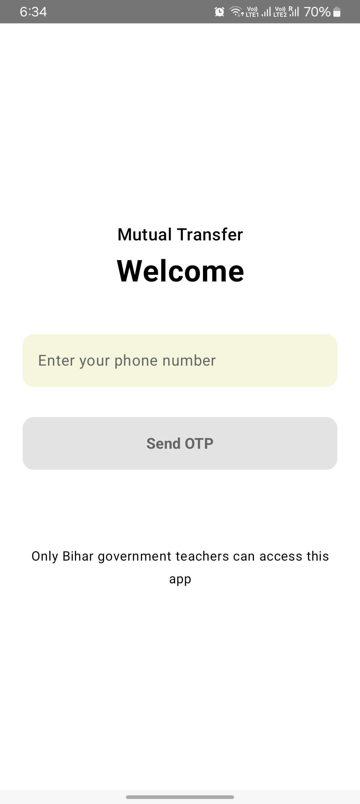
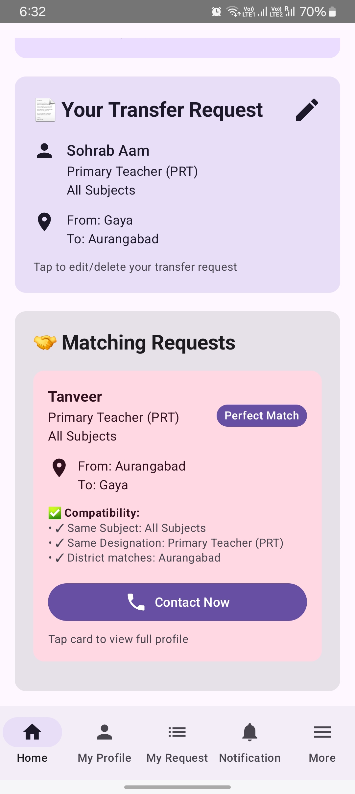
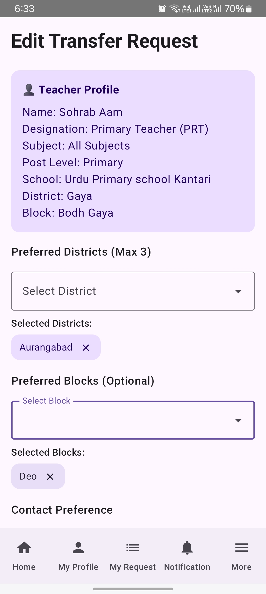
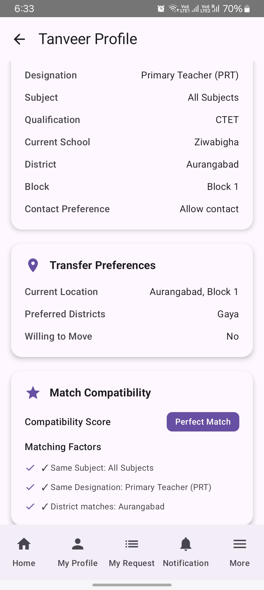
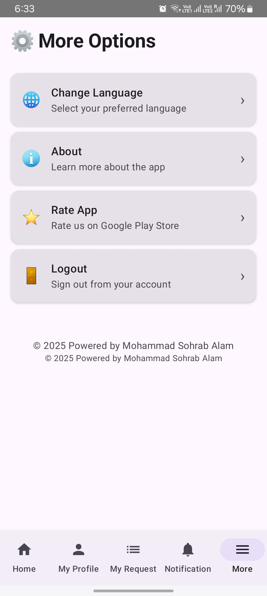

# 📱 Mutual Transfer App for Bihar Government Teachers

An Android app designed to help Bihar government school teachers find suitable partners for mutual transfers efficiently and securely.

---

## 🔥 Highlights

- 🔐 OTP-based login using Firebase Authentication
- 🔍 Real-time matching of teachers based on subject, district, and school preferences
- ☁️ Firestore-based backend for live data sync
- ⚡ Built with Jetpack Compose and MVVM architecture
- 📦 Released and deployed on Google Play

---

## 🛠 Tech Stack

- **Language:** Kotlin  
- **Architecture:** MVVM + Clean Architecture  
- **UI:** Jetpack Compose  
- **Backend:** Firebase Firestore  
- **Auth:** Firebase OTP  
- **DI:** Hilt  
- **Storage:** DataStore + Firestore  
- **Security:** Proguard, Google Play App Signing  
- **Testing:** Manual QA, Internal testing

---

## 🎥 Demo Video

📺 [Watch on YouTube](https://your-demo-link.com)  
*(Note: You can upload a Loom/YouTube/Drive video showing a walkthrough of login, filtering, and matching.)*

---

## 📸 Screenshots

| Login | Dashboard | Filter & Match | Profile | Notification | Settings |
|-------|-----------|----------------|
|  |  |  |    |   |   

---

## 🧑‍💼 My Role

> I independently designed, developed, deployed, and currently maintain this Android app.  
From UI/UX design to backend logic and Firebase integration, this is a solo project built to solve a real need for teachers in the Bihar education system.

---

## 🚀 Download

📦 [Google Play Store](https://play.google.com/store/apps/details?id=com.shikshak.transfer)

---

## 📩 Contact

For demo access, collaboration, or freelance inquiries:  
📧 **Iamsohrabalam@gmail.com**  
🔗 [LinkedIn](https://www.linkedin.com/in/mohammad-sohrab-alam-8105474b/)  
🔗 [GitHub](https://github.com/md-sohrab-alam)

---

> ℹ️ This repository is for portfolio and presentation purposes only. The source code is **not publicly available** to protect the product’s logic and IP.

